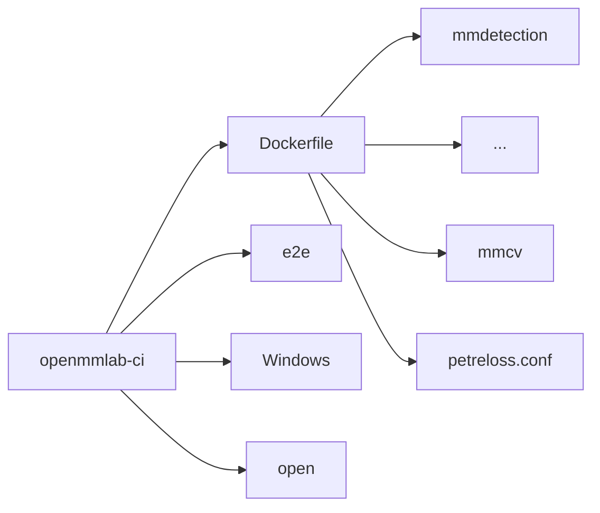

# __Dockerfile__

## __1. Functions And Features__

It's used to create images for different codebases.

## __2. The Directory Structure__

Different docker environment files are in the corresponding directories.

