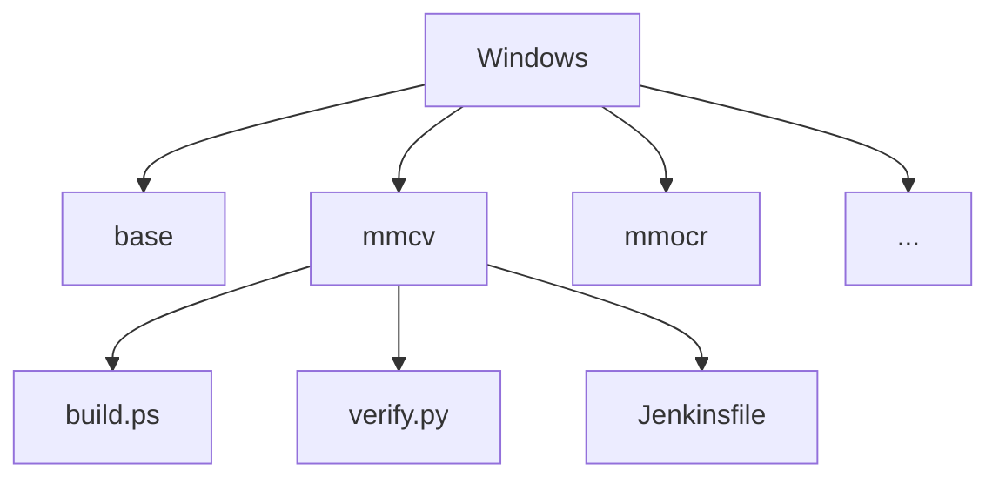

# __Windows__
    
## __1. Function and Features__

- Install the necesssary environments for Windows OS

- Download some precompiled package for Windows OS

## __2.Getting Started__

### 2.1 Directory Structure

### 2.1 The Meaning of Most Files and Directories

+ base
    - build.py &nbsp; : &nbsp;&nbsp; build conda env
    - requirements.txt &nbsp; : &nbsp;&nbsp; the necessary libraries
+ mmcv
    - Codes needed to set up the envoronment for mmcv
