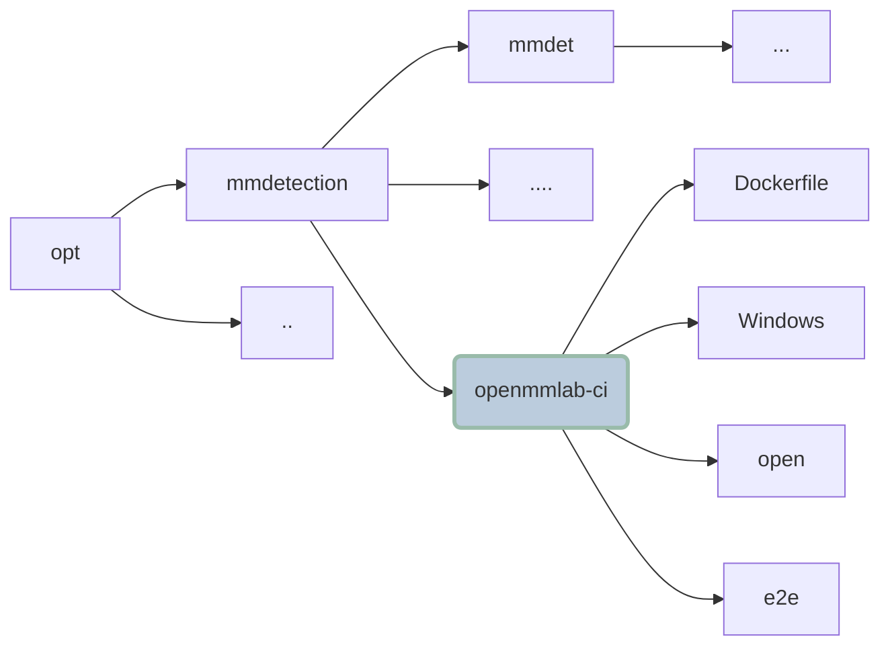

# __e2e__

## __1. Function and Features__

It's end-to-end tests, i.e. integration tests, for different codebases. 

+ mmdetection
+ mmdeploy
+ mmpose
+ ......

## __2. For a Brief Overview of How It Works in Docker__

According to the pipeline, the basic steps are listed as following: 

- Build docker
- Build image
- Unit test
- Integration test

## __3. Getting Started__

### 3.1 Directory Structure in Docker

### 3.2 How to Write Cases

1. Framework

    This project uses pytest as the main frame, probably some relavant extensions like pytest-xdlist and pytest-rerunfailures in the future. Install all of them according to the requirements.txt.

2. Write Cases

- Prepare or download all the mateirals you need, like small dataset, checkpoints, configuration files and so forth.
- Run (Subprocess, CUP by Baidu, etc) the python file you wanna test
- Capture the returncode, stdout, stderr and so on to judge the whether it meets your expectations. If not, display some feedback.
- Log some important informations which may inform us of how the process is going on and help us better locate where the errors or warnings might be.

### 3.3 Apply it in docker
- [x] Add your e2e tests to the directory "e2e"
- [ ] Push the code to the remote repo
- [ ] Recommended: Establish your job by duplicating the existing job setting for easier and faster development and modifying it later
- [ ] Quote your remote repo and its corresponding branch in the pipeline code
- [ ] Run the job and wait for your result

