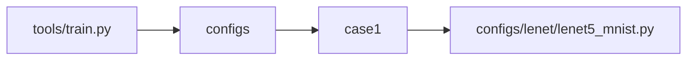
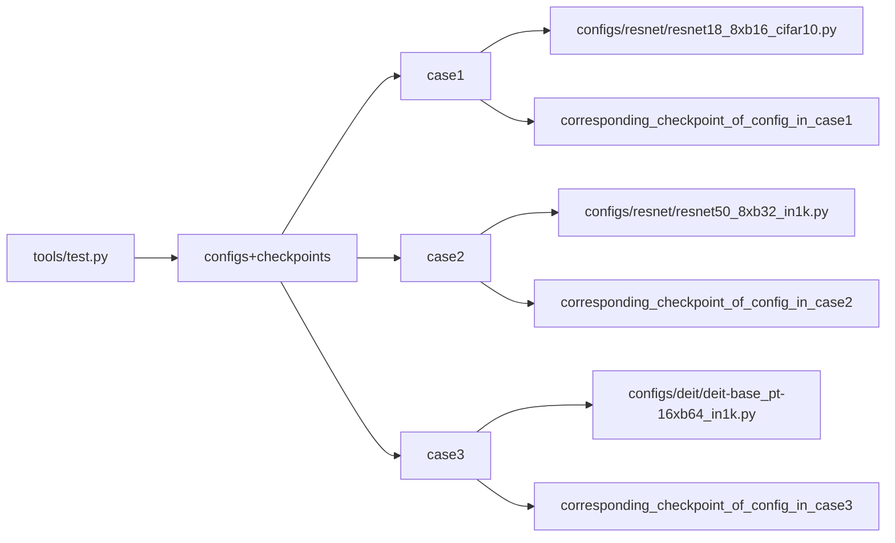

# __MMClassification__

## __1. Integration Test__

### __1.1 run properly__

- Dataset Explaination
    + We prepare the dataset ["In1k"](https://www.kaggle.com/datasets/ifigotin/imagenetmini-1000) and save __only part of it__ in this repo
        - Pictures
            + We only save one picture of each category. Same for train and test dataset
            + There is a modification tool for this data extraction.
        - Classificatoin annotation file
            + We generate the classification annotation file by ourselves, since I failed to find the official annotation file. 
            + I just simply name the class number with its order in the dataset.
            + It's not an accuracy test, so the insecuracy of annotation file is allowed.
    + We prepare the dataset [Mnist](http://yann.lecun.com/exdb/mnist/) and save all of it in this repo
        - This dataset is so small, so we just save __all of it__, and the model can parse it itself.
    + We download [cifar10](https://www.cs.toronto.edu/~kriz/cifar-10-python.tar.gz) and save all of it.
        - This is dataset is only for test.py
        - We use decorator to make it downloaded before the case starts.

#### __1.1.1 test tools/train.py__

- We test the file "tools/train.py" by calling the module with certain pairs of parameters.
- The parameters are displayed in the following form. 
    + The root node is the file we test.
    + The second level of the tree is the different sets of parameters combination we use.
    + The subbranches of case X is the specific parameter values we use.
- We catch the failure when the returncode is not 0.

#### __1.1.2 test tools/test.py__

- We catch the failure when the returncode is not 0.
- We use the tools in the "utils" directory to __grasp the checkpoint file according to the config file name__
- Graph Explaination
    - We test the file "tools/train.py" by calling the module with certain pairs of parameters.
    - The parameters are displayed in the following form.
        + The root node is the file we test.
        + The second level of the tree is the different sets of parameters combination we use.
        + The subbranches of case X is the specific parameter values we use.

## __2. Accuracy Test__

### 2.1 NOT REALIZED YET

## __3. Unit Test__

The unit tests from MMDetection Codebase are not included in this repo. But it will be automatically tested in CI.

