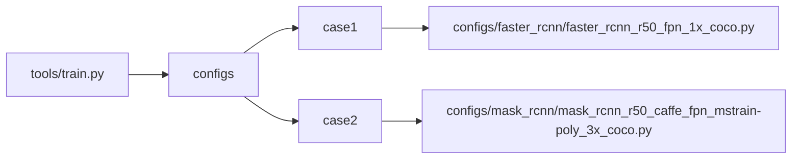
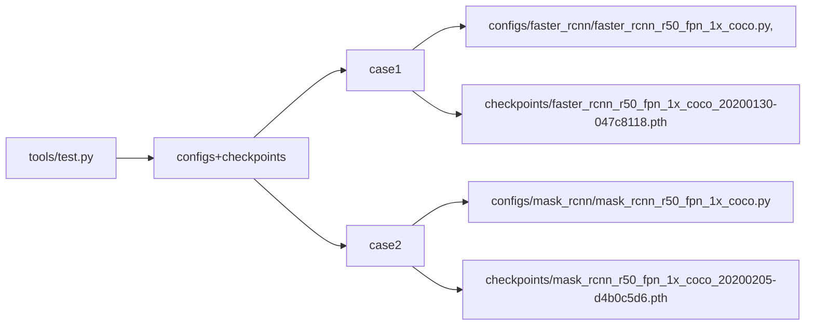

# __MMDetection__

## __1. Integration Test__

- Dataset Explanation
    + COCO
        - Prepare data
            + extract some image items (default 120 images) out of the complete coco JSON files including train, validation and test, to form our own smaller dataset. 
            + download the images according to the JSON file

- Testing Methods
    + We test the file "***.py" by calling the module with certain pairs of parameters.
    + We catch the failure when the returncode is not 0.
    + Modify the config by command parameters to speed up training and make sure that it fits the shared memory in docker
        - data.workers_per_gpu=0 
        - data.samples_per_gpu=1 
        - train_pipeline.2.img_scale=(1333,128)
        - runner.max_epochs=1
    + We give the hint of the possible error. For example the network error which makes it fail to download images.
        
- Problem You Might Come Across
    + Sometimes the network delay or error may cause the failure of downloading images. We will report this error, and you can ignore this assertion since it's not the fault of the model. 
    + The preparation of the data for the testing of train.py and test.py will be executed only once since they share part of the data.

- Graph Explanation
    + The parameters are displayed in the following form. 
    + The root node is the file we test.
    + The second level of the tree is the different sets of parameters combination we use.
    + The subbranches of case X is the specific parameter values we use.

### __1.1 run properly__

#### __1.1.1 test tools/train.py__

- We test the file "tools/train.py" by calling the module with certain pairs of parameters.
- The parameters are displayed in the following form. 
    + The root node is the file we test.
    + The second level of the tree is the different sets of parameters combination we use.
    + The subbranches of case X is the specific parameter values we use.
- We catch the failure when the returncode is not 0.

#### __1.1.2 test tools/test.py__

- We test the file "tools/train.py" by calling the module with certain pairs of parameters.
- The parameters are displayed in the following form.
    + The root node is the file we test.
    + The second level of the tree is the different sets of parameters combination we use.
    + The subbranches of case X is the specific parameter values we use.
- We catch the failure when the returncode is not 0.

## __2. Accuracy Test__

### 2.1 NOT REALIZED YET

## __3. Unit Test__

The unit tests from MMDetection Codebase are not included in this repo. But it will be automatically tested in CI.

