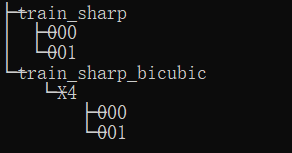
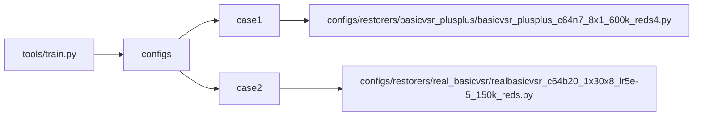
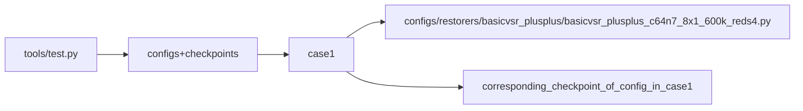
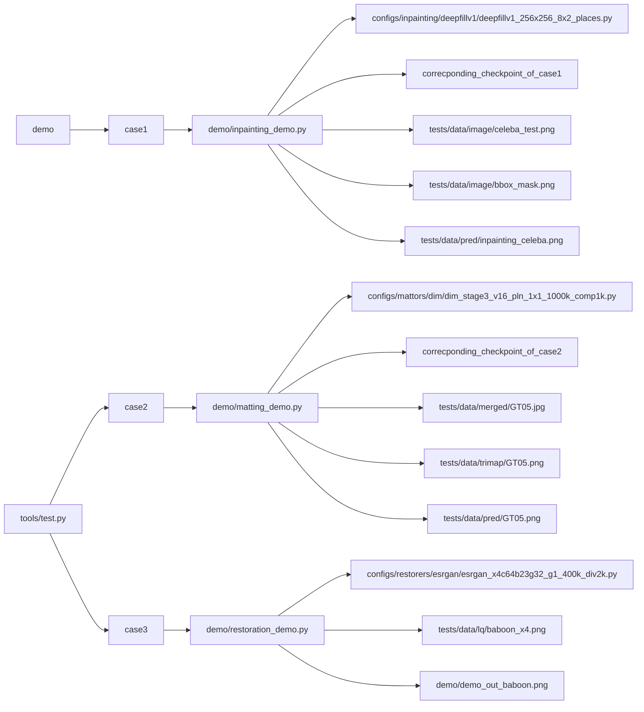

# __MMEditing__

## __1. Integration Test__

- Dataset Explanation
    + REDS
        - We get only two clips (000 and 001) from the original dataset.
        - Notice: the training dataset is different from the dataset taken by the camera. There are two sets on [the given website](https://seungjunnah.github.io/Datasets/reds.html)
        - The size of the images are in 320*180, but the images from camera is 1280*720 which will cause the error.
        - The arrange the dataset in the following stucture: 

- Testing Methods
    + We test the file "***.py" by calling the module with certain pairs of parameters.
    + We use the tools in the "utils" directory to __grasp the checkpoint file according to the config file name__
    + We catch the failure when the returncode is not 0.

- Modify the Hardcode
    + We modify the hardcode with "seds" instruction in "run.sh" so that our smaller REDS dataset can work with the config below
        + In "mmediting/mmedit/datasets/sr_reds_multiple_gt_dataset.py"
            ```
            line 58: range(0, 270)    ==>     range(0, 2)
            line 82: sequence_length=100    ==>   sequence_length=8
            ```
    + For the above modification, range 2 means we have only two clips and sequence_length=8 means REDS has 8 frames for each clip
    + Notice: We have to rebuild mmediting after modifying the hardcode. We also have done it in "run.sh".

- Problem You Might Come Across
    + MMEditing has its own pytest config in "setup.cfg", and set the rootdir of pytest in "test/". 
      So we have to add a pytest.ini in e2e/mmediting(the directory we ) to reset the rootdir.

- Graph Explanation
    + The parameters are displayed in the following form. 
    + The root node is the file we test.
    + The second level of the tree is the different sets of parameters combination we use.
    + The subbranches of case X is the specific parameter values we use.

### __1.1 run properly__ 

#### __1.1.1 test tools/train.py__



#### __1.1.2 test tools/test.py__



#### __1.1.3 test demo__

- We get the demo cases according to [Demo Cases](https://openmmlab.feishu.cn/sheets/shtcnyJkftUnvIvlx1gqLGFPq8d)



## __2. Accuracy Test__

### 2.1 NOT REALIZED YET


## __3. Unit Test__

The unit tests from MMDetection Codebase are not included in this repo. But it will be automatically tested in CI.

