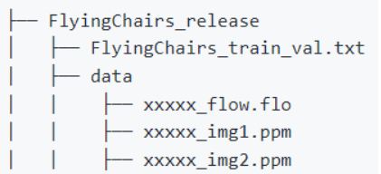
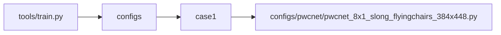
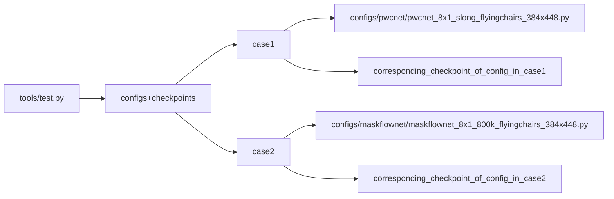

# __MMFlow__

## __1. Integration Test__

### __1.1 run properly__

- Dataset Explaination
    + We prepare the dataset ["Flying Chairs"](http://lmb.informatik.uni-freiburg.de/data/FlyingChairs/FlyingChairs.zip) and save it in this repo
    + "Flying Chairs"'s directory structure
        
    +  Flying Chairs中，FlyingChairs_train_val.txt
        - one line represents one sample
        - 1 means train sample and 2 means test sample
    + We use four samples for training and 2 samples for testing

#### __1.1.1 test tools/train.py__

- We test the file "tools/train.py" by calling the module with certain pairs of parameters.
- The parameters are displayed in the following form. 
    + The root node is the file we test.
    + The second level of the tree is the different sets of parameters combination we use.
    + The subbranches of case X is the specific parameter values we use.
- We catch the failure when the returncode is not 0.

#### __1.1.2 test tools/test.py__

- We test the file "tools/train.py" by calling the module with certain pairs of parameters.
- The parameters are displayed in the following form.
    + The root node is the file we test.
    + The second level of the tree is the different sets of parameters combination we use.
    + The subbranches of case X is the specific parameter values we use.
- We catch the failure when the returncode is not 0.
- We use the tools in the "utils" directory to grasp the checkpoint file according to the config file name

## __2. Accuracy Test__

### 2.1 NOT REALIZED YET

## __3. Unit Test__

The unit tests from MMDetection Codebase are not included in this repo. But it will be automatically tested in CI.

