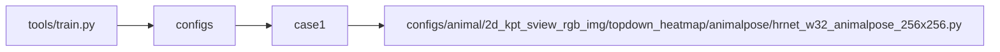
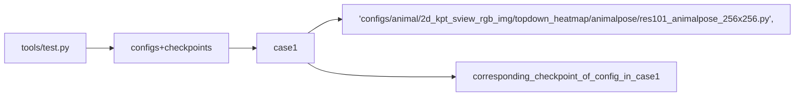

# __MMPose__

## __1. Integration Test__


- Testing Methods
    + We test the file "***.py" by calling the module with certain pairs of parameters.
    + We use the tools in the "utils" directory to __grasp the checkpoint file according to the config file name__
    + We catch the failure when the returncode is not 0.

- Graph Explanation
    + The parameters are displayed in the following form. 
    + The root node is the file we test.
    + The second level of the tree is the different sets of parameters combination we use.
    + The subbranches of case X is the specific parameter values we use.

### __1.1 run properly__

#### __1.1.1 test tools/train.py__



#### __1.1.2 test tools/test.py__



#### __1.1.3 test demo__

```mermaid
graph LR;
    demo-->top_down_img_demo.py
    top_down_img_demo.py-->case1.1
    case1.1-->config=configs/animal/2d_kpt_sview_rgb_img/topdown_heatmap/macaque/res50_macaque_256x192.py
    case1.1-->corresponding_checkpoint_of_config_in_case1.1
    case1.1-->img-root
    case1.1-->json-file
    case1.1-->out-img-root

    demo-->top_down_video_demo_full_frame_without_det.py
    top_down_video_demo_full_frame_without_det.py-->case2.1
    case2.1-->config=configs/animal/2d_kpt_sview_rgb_img/topdown_heatmap/fly/res152_fly_192x192.py
    case2.1-->corresponding_checkpoint_of_config_in_case2.1
    case2.1-->video-path

    demo-->top_down_video_demo_with_mmdet.py
    top_down_video_demo_with_mmdet.py-->case3.1
    case3.1-->config_mmpose=demo/mmdetection_cfg/faster_rcnn_r50_fpn_coco.py
    case3.1-->corresponding_checkpoint_of_config_in_case3.1__checkpoint_mmpose
    case3.1-->config_mmdet=configs/animal/2d_kpt_sview_rgb_img/topdown_heatmap/horse10/res50_horse10_256x256-split1.py
    case3.1-->checkpoint_mmdet=URL=res50_horse10_256x256_split1-3a3dc37e_20210405.pth
    case3.1-->video_path=demo/resources/demo.mp4
    case3.1-->out-video-root
    case3.1-->bbox-thr
    case3.1-->kpt-thr
    case3.1-->det-cat-id
```

## __2. Accuracy Test__

### 2.1 NOT REALIZED YET


## __3. Unit Test__

The unit tests from MMPose Codebase are not included in this repo. But it will be automatically tested in CI.

## __4. Usage__

use the command "bash run.h" to run e2e test