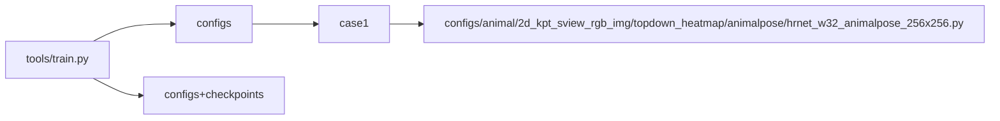
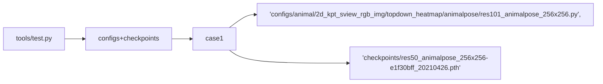

# __MMPose__

## __1. Integration Test__

### __1.1 run properly__

#### __1.1.1 test tools/train.py__



#### __1.1.2 test tools/test.py__



#### __1.1.3 test demo__

All the commands are from the corresponding README file. 

```mermaid
graph LR;
    demo-->top_down_img_demo.py
    top_down_img_demo.py-->case1.1
    case1.1-->config
    case1.1-->checkpoint
    case1.1-->img-root
    case1.1-->json-file
    case1.1-->out-img-root

    demo-->top_down_video_demo_full_frame_without_det.py
    top_down_video_demo_full_frame_without_det.py-->case2.1
    case2.1-->config=configs/animal/2d_kpt_sview_rgb_img/topdown_heatmap/fly/res152_fly_192x192.py
    case2.1-->checkpoint=https://download.openmmlab.com/mmpose/animal/resnet/res152_fly_192x192-fcafbd5a_20210407.pth
    case2.1-->video-path

    demo-->top_down_video_demo_with_mmdet.py
    top_down_video_demo_with_mmdet.py-->case3.1
    case3.1-->video_path=demo/resources/demo.mp4
    case3.1-->out-video-root
    case3.1-->bbox-thr
    case3.1-->kpt-thr
    case3.1-->det-cat-id
```

## __2. Unit Test__

## __2.1 The Unit Test in the Repo__

+ xxx
+ xxx

## __3. Accuracy Test__

### 3.1 NOT REALIZED YET

